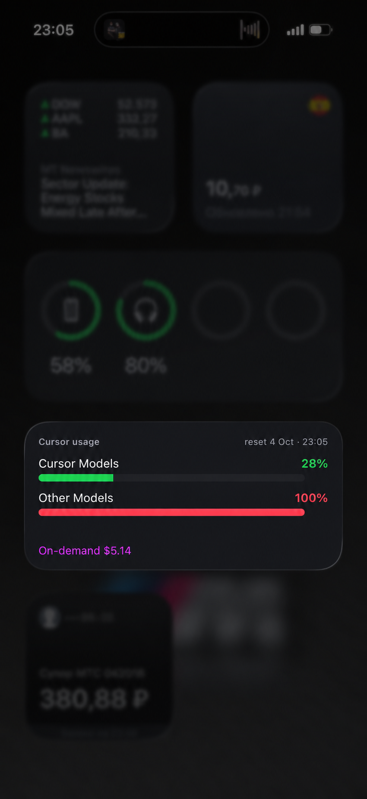

# Cursor Usage widget (Scriptable)

iPhone Home Screen widget for Cursor Spending: Cursor Models %, Other Models %, reset date, and on-demand dollars when they exist.

[](docs/iphone-medium-widget.png)

There is no official personal usage API. The widget calls the same unofficial `https://cursor.com/api/usage-summary` endpoint as the web dashboard. It can break if Cursor changes that payload.

## Install

1. iPhone: install [Scriptable](https://scriptable.app), enable iCloud Drive for it, open the app once so `iCloud Drive/Scriptable` appears.
2. Copy `scriptable/CursorUsage.js` into a new Scriptable script named **CursorUsage**.
3. Mac: run `python3 scripts/sync-cursor-token` (Cursor desktop must have been used on this Mac).
4. Confirm `iCloud Drive/Scriptable/CursorUsage/token.txt` exists and has one line. Wait for iCloud to reach the phone.
5. iPhone Home Screen → Edit → Add Widget → Scriptable → Small and/or Medium → pick script **CursorUsage**.

## Manual cookie fallback

If the helper prints that it could not update the token:

1. Desktop browser → https://cursor.com/dashboard/spending → DevTools → Application → Cookies → `WorkosCursorSessionToken`.
2. Paste that value as the only line in `iCloud Drive/Scriptable/CursorUsage/token.txt`.
3. Tap the widget (or run the script in Scriptable) to refresh.

The helper never overwrites `token.txt` with a token that got HTTP 401/403.

## Refresh (not true realtime)

iOS decides when widgets redraw. This script asks for a refresh in 5 minutes; the system often waits 15–60 minutes.

Faster:

- Tap the widget (opens Scriptable and re-runs the script).
- Shortcuts: Automation → Personal → Time of Day / Repeat every 15 minutes → Run Script → CursorUsage. Or add a Shortcut “Refresh Cursor Usage” that runs that script and pin it to Lock Screen / Control Center.

## Tests

```bash
node --test tests/*.js
python3 -m unittest tests.test_sync_cursor_token -v
```

## Manual checklist

- [ ] Small with on-demand: title `Usage`, bars `Cursor` / `Others`, footer `On-demand $X.XX`, no reset date, labels not clipped
- [ ] Small without on-demand: footer is reset date `d MMM` (empty footer if `resetAt` is missing)
- [ ] Medium: two bars, reset + time, on-demand only if Spending shows extra spend
- [ ] Light and dark Home Screen
- [ ] Empty/missing token → Add token
- [ ] Bad token → Token expired
- [ ] Airplane mode after a successful load → gray stale numbers, old time on medium
- [ ] Tap refreshes
- [ ] Percents match https://cursor.com/dashboard/spending
